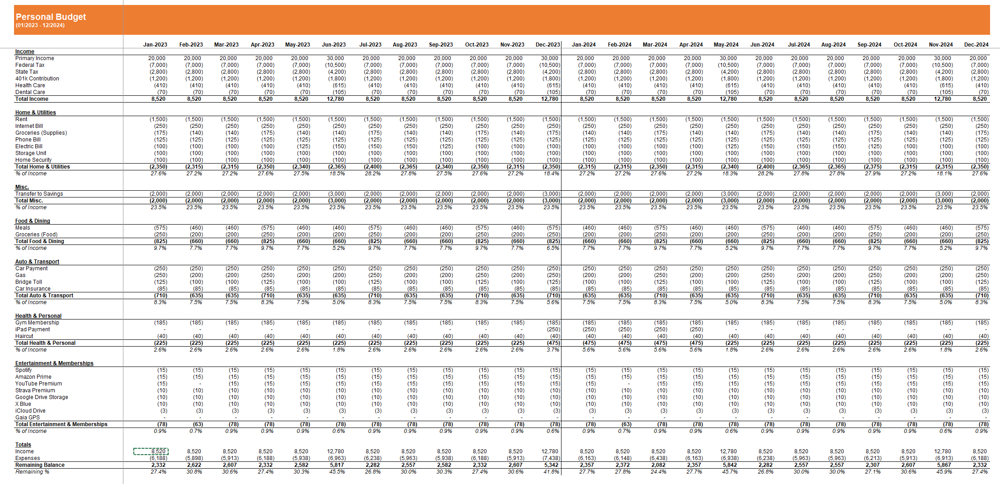

# Personal-Budget-Tool

Excel + Python collaboration that generates a personal budget tool in Excel based on user input.

## Overview
App to dynamically build a functional personal budget in Excel & Python based on user input. 

## Quick Start
- Download or clone the repository.
- Edit the Budget Items in the [Inputs](src/Inputs.xlsx) file to add your own expenses.
- Run `python personal_budget_tool/app.py` to generate your Excel File
- Confirm your changes are visibile in the summary & data tabs.

  
## Application

### InputConfig
A small handler used to prompt the user for entries in the Inputs file. Opens the [Inputs](src/Inputs.xlsx) file to allow you to view/edit prior to building the budget. 

### DataBuilder
- Reads data from Inputs, generates a calendar tied to the budget. Writes data out for use in the output. Stores logic behind working with `frequency` & deciding where budgeted amounts will be allocated by day. 

### BudgetApp
- In short, a massive wrapper for [xlwings](https://github.com/xlwings/xlwings) operations. The template itself is barebones, so all of the styling, formulas and data is coming via this module.

## Output

